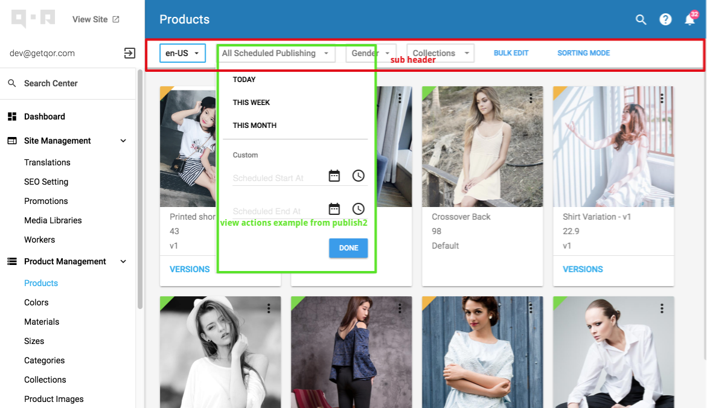
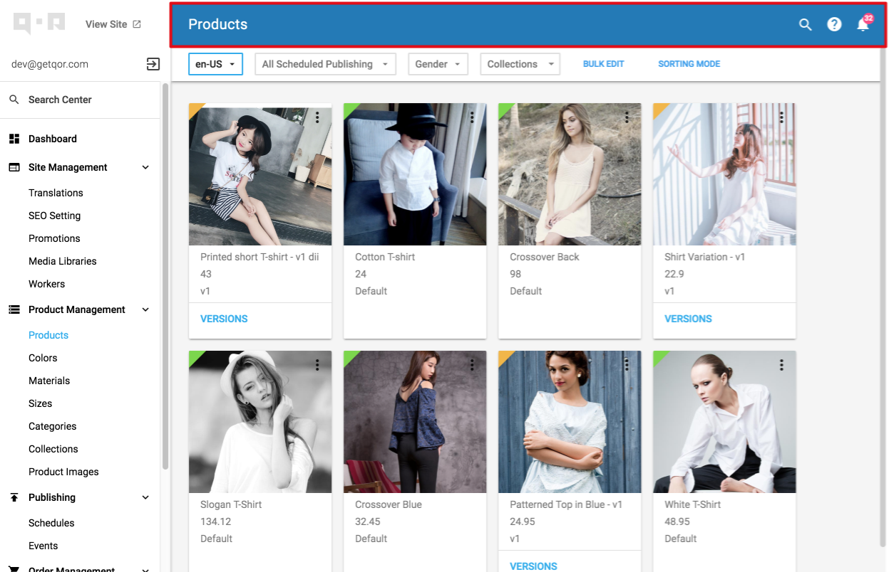

# Extend QOR Admin

QOR Admin aims to be a flexible, easily extendable, and highly configurable admin framework that could fit most business requirements. In this chapter, we will learn how to extend the admin framework.

## Resource

### Extend QOR Resource

When added a struct to QOR Admin, QOR Admin will check if this struct and its embedded structs implemented interface [ConfigureResourceBeforeInitializeInterface](https://godoc.org/github.com/conku/qor/resource#ConfigureResourceBeforeInitializeInterface) or [ConfigureResourceInterface](https://godoc.org/github.com/conku/qor/resource#ConfigureResourceInterface)

The [`ConfigureResourceBeforeInitializeInterface`](https://godoc.org/github.com/conku/qor/resource#ConfigureResourceBeforeInitializeInterface) interface will be invoked before initializing the resource.

The [`ConfigureResourceInterface`](https://godoc.org/github.com/conku/qor/resource#ConfigureResourceInterface) interface will be invoked after initializing the resource.

So when `AddResource`, the workflow looks like:

```go
type User struct {
}

func (User) ConfigureQorResourceBeforeInitialize(resource.Resourcer) {
  // do something before initialize
}

func (User) ConfigureQorResource(resource.Resourcer) {
  // do something after initialize
}

user := Admin.AddResource(&User{})
// 1, run User.ConfigureQorResourceBeforeInitialize(user)
// 2, Apply default settings to Resource
// 3, run User.ConfigureQorResource(user)
```

This is helpful when writing QOR Plugins, most plugins are written based on that, for example: [QOR L10n](https://github.com/conku/l10n), [QOR Publish2](https://github.com/conku/publish2)

### Overwrite CURD Handler

QOR Admin generates default CURD Handlers based on GORM's API, if your resource is not a GORM-backend model, you can consider to write your own CRUD handler, like save it into Redis or a cache server, like:

```go
res.FindOneHandler = func(result interface{}, metaValues *resource.MetaValues, context *qor.Context) error {
  // find record and decode it to result
}

res.FindManyHandler = func(results interface{}, context *qor.Context) error {
  // find records and decode them to results
}

res.SaveHandler = func(result interface{}, context *qor.Context) error {
  // save result
}

res.DeleteHandler = func(result interface{}, context *qor.Context) error {
  // delete result
}
```

Checkout https://github.com/conku/qor/blob/master/resource/crud.go to get some hints from default implementations

Generate [nested RESTFul API](/admin/restful_api.md#nested-api) is using this feature.

### Attributes

[As you know](/admin/fields.md#customize-visible-fields), you could set index/show/edit/new page's attributes with `IndexAttrs`, `NewAttrs`, `EditAttrs`, `ShowAttrs`.

When you writing plugins, you might have requirements that always show or hide some attributes, `OverrideIndexAttrs`, `OverrideNewAttrs`, `OverrideEditAttrs`, `OverrideShowAttrs` are for the job, you could write it like:

```go
// Each time you configured EditAttrs for the resource, we will append field `PublisReady` and remove `State` from edit attrs.
res.OverrideEditAttrs(func() {
  res.EditAttrs(res.EditAttrs(), "PublishReady", "-State")
})
```

## Metas

### Reconfigure Meta

QOR Admin will combine your Meta configurations, the latest configuration will overwrite previous one.

```go
user.Meta(&admin.Meta{Name: "Gender", Label: "Select Gender", Config: &admin.SelectOneConfig{Collection: []string{"Male", "Female", "Unknown"}}})
user.Meta(&admin.Meta{Name: "Gender", Config: &admin.SelectOneConfig{Collection: []string{"Male", "Female"}}})

// becomes

user.Meta(&admin.Meta{Name: "Gender", Label: "Select Gender", Config: &admin.SelectOneConfig{Collection: []string{"Male", "Female"}}})
```

### Register Meta Processor

Meta Processor will be call each time reconfigure a `Meta`

```go
genderMeta := user.Meta(&admin.Meta{Name: "Gender", Label: "Select Gender", Config: &admin.SelectOneConfig{Collection: []string{"Male", "Female"}}})

genderMeta.AddProcessor(*admin.MetaProcessor{
  Name: "make-sure-label-is-select-gender",
  Handler: func(meta *admin.Meta) {
    meta.Label = "Select Gender"
  },
})
```

### Create New Meta Types

QOR Admin only provides [Common Meta types](/admin/fields.md#common-meta-types), you can easily create your own one, like:

```go
user.Meta(&admin.Meta{Name: "FieldName", Type: "my-fancy-meta-type"})
```

Then create templates `meta/index/my-fancy-meta-type.tmpl`, `meta/show/my-fancy-meta-type.tmpl`, and put them into qor view paths, you are done.

`meta/index/my-fancy-meta-type.tmpl` will be used when rendering index page, if it doesn't exist, QOR Admin will use the meta's value from [`Valuer`](/admin/fields.md#valuer), and show it as a string in the listing table.

`meta/form/my-fancy-meta-type.tmpl` will be used when rendering show/edit page, this file must exist to render the meta correctly.

Check out [QOR Slug](http://github.com/conku/slug) as an example.

### Create Meta Config

If you want to pass some configurations to view, Meta Config is for you, different type of Metas usually have different things to configure, like meta `select one`, you can configure its data source, open type, for meta `rich editor`, you can configure its used plugins, asset manager.

For your created meta types, if you have requirements to pass configuration to views, it's better to create a Meta Config for it, e.g:

```go
type FancyMetaConfig struct {
  Config1 string
  Config2 string
}

// Meta Config has to implement this interface
func (FancyMetaConfig) ConfigureQorMeta(metaor resource.Metaor) {
  if meta, ok := metaor.(*admin.Meta); ok {
    // do something for meta
  }
}
```

Refer [Rich Editor Config](https://github.com/conku/admin/blob/master/meta_rich_editor.go) as example.

### Default Meta Configor

Meta Configor is something registered into Admin globally, any metas registered later will call `Meta Configor`, e.g:

```go
// All `date` metas will get a default FormattedValuer if it is not configured.
Admin.RegisterMetaConfigor("date", func(meta *Meta) {
    if meta.FormattedValuer == nil {
        meta.SetFormattedValuer(func(value interface{}, context *qor.Context) interface{} {
            switch date := meta.GetValuer()(value, context).(type) {
            case *time.Time:
                if date == nil {
                    return ""
                }
                if date.IsZero() {
                    return ""
                }
                return utils.FormatTime(*date, "2006-01-02", context)
            case time.Time:
                if date.IsZero() {
                    return ""
                }
                return utils.FormatTime(date, "2006-01-02", context)
            default:
                return date
            }
        })
    }
})
```

Check [Meta Configors](https://github.com/conku/admin/blob/master/meta_configors.go) for more examples.

## Customize View

Checkout [customize templates](/admin/theming_and_customization.md#customize-templates) for how to overwrite view

### Register FuncMap

Register func map to views, then you could use them in your templates.

```go
Admin.RegisterFuncMap("my_fancy_func", func() string {
  return "my_fancy_func"
})
```

## View Actions

If you put any templates to `{qor view paths}/actions`, it will be loaded for index/edit/new/show pages automatically.

And you can only load an HTML snippet for your index page, by creating a template `{qor view paths}/actions/index/my_html_snippet.tmpl`, it will be loaded into page's subheader.



[QOR Activity](https://github.com/conku/activity), [QOR Publish2](https://github.com/conku/publish2) are built based on this strategy.

### View Actions for Header

If you put a template into `{qor view paths}/actions/header`, it will be loaded in the top area of your admin site, e.g:



[QOR Help](https://github.com/conku/help), [QOR Notification](https://github.com/conku/notification) are built based on it.

## Router

You can define your own routes using `Router`.

Routes (a.k.a. mux, handlers) are a way to map from a URL path to some code which is executed when an end-user accesses that path.

### Registering HTTP routes

First, get `router` from [QOR Admin](/admin/README.md)...

```go
router := Admin.GetRouter()
```

#### General routes

```go
router.Get("/path", func(context *admin.Context) {
  // do something here
})

router.Post("/path", func(context *admin.Context) {
  // do something here
})

router.Put("/path", func(context *admin.Context) {
  // do something here
})

router.Delete("/path", func(context *admin.Context) {
  // do something here
})
```

#### Naming route

```go
router.Get("/path/:name", func(context *admin.Context) {
  context.Request.URL.Query().Get(":name")
})
```

#### Regexp support

```go
router.Get("/path/:name[world]", func(context *admin.Context) { // "/hello/world"
  context.Request.URL.Query().Get(":name")
})

router.Get("/path/:name[\\d+]", func(context *admin.Context) { // "/hello/123"
  context.Request.URL.Query().Get(":name")
})
```

### Middlewares

QOR Admin's Router has middlewares support, you could do some advanced work with it, take below code as example:

```go
db1 := gorm.Open("sqlite", "db1.db")
db2 := gorm.Open("sqlite", "db2.db")

Admin.GetRouter().Use(&admin.Middleware{
  Name: "switch_db",
  Handler: func(context *admin.Context, middleware *admin.Middleware) {
    // switch admin's database to db2 for products related requests
    if regexp.MustCompile("/admin/products").MatchString(context.Request.URL.Path) {
      context.SetDB(db2)
    }
    middleware.Next(context)
  },
})
```
